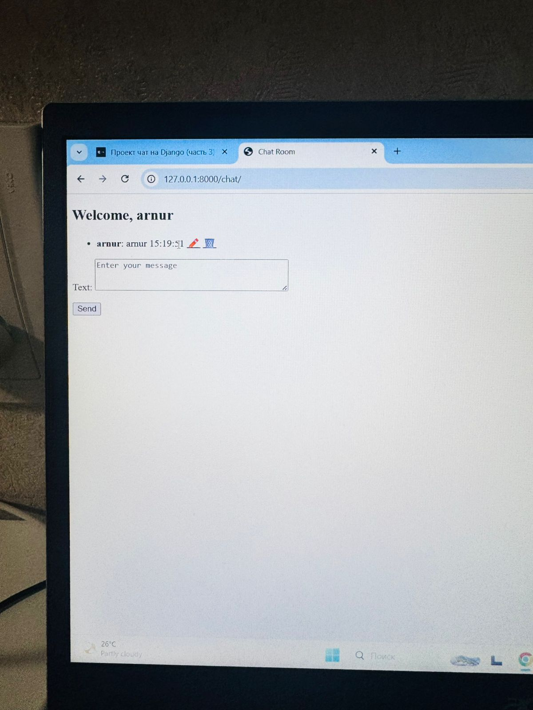
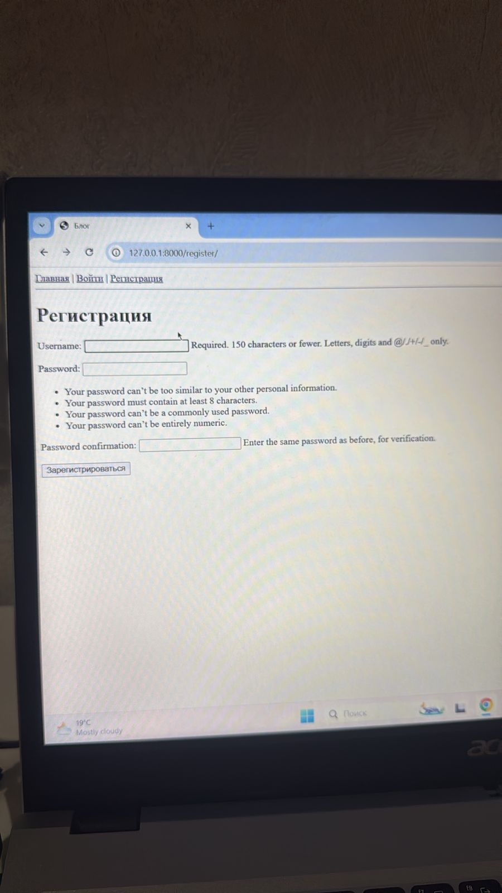
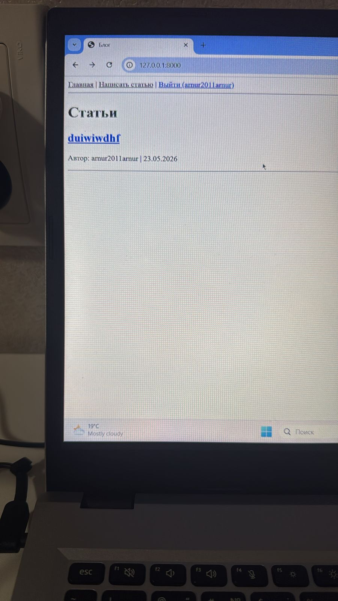
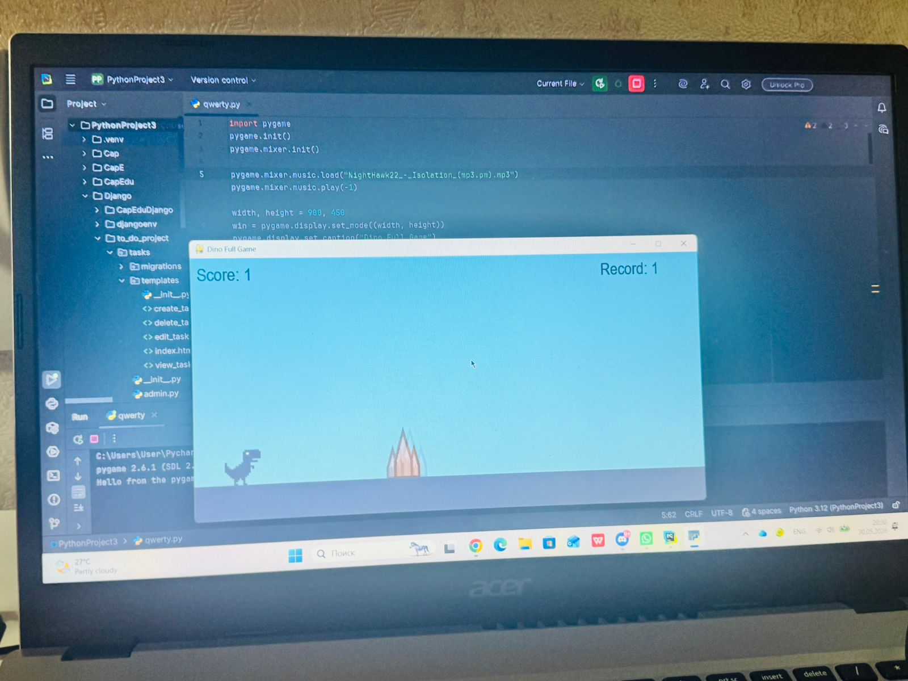
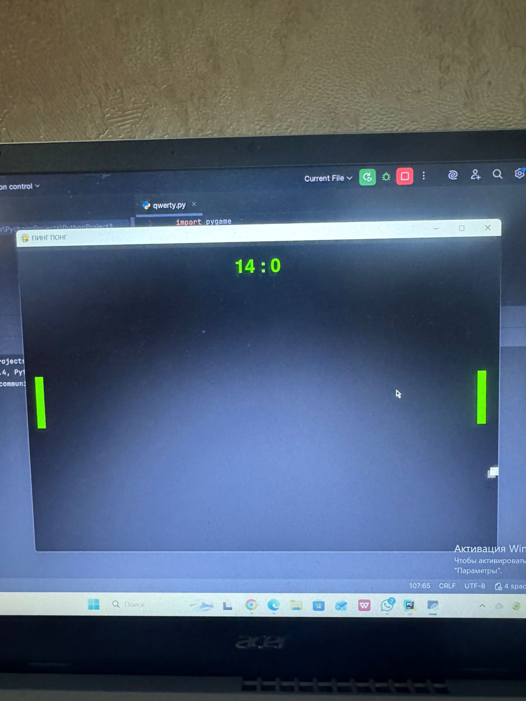

Привет! Я Арнур 👋

Обо мне

Я начинающий разработчик из Казахстана. Изучаю Python и Django, начинаю осваивать C++. Интересуюсь программированием, математикой, технологиями и космосом. Постоянно работаю над новыми проектами и развиваю свои навыки.

Мои проекты

ToDo List на Django

Веб-приложение для управления задачами с использованием Django.Здесь я вам покажу где можно писать лист и там обезательно регистрироваться 

Блог на Django

Личный блог с возможностью публикации и просмотра статей.тут есть коментарии редактор и тд все для блога 
также это фотка где вы можете ипсать статьи тоесть коменты 
Игра «Динозаврик» на Pygame

Аркадная игра, вдохновлённая Chrome Dino, созданная на Python с использованием Pygame. Вот фотка моей игры там есть музыка и интро 

Pong на Pygame

Классическая игра «Пинг-понг», реализованная на Python с помощью Pygame. тут также как и в дино игре есть сложности каждые 2 очка скорость мяча увеличивается 

Технологии и инструменты

* Python
* Django
* Pygame
* Начальный уровень C++

Цели

* Углубить знания C++
* Создавать более сложные веб-приложения на Django
* Разрабатывать собственные игры
* Изучать технологии, связанные с космосом и наукой
